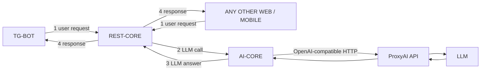

# Системная архитектура

Исходная схема: [assets/architecture-diagram.png](assets/architecture-diagram.png)

## Правило оркестрации

`REST-CORE` — единственная точка входа. Он принимает запрос, валидирует, при необходимости ходит в БД, вызывает `AI-CORE`, собирает ответ и отдаёт клиенту.

`AI-CORE` — внутренний NLP/LLM-сервис. Сам не принимает пользовательский трафик.

`ProxyAI` — внешний HTTP API (один сервис-прокси к моделям). Запросы к модели идут **только** из `ai-core` через него. Прямых вызовов OpenAI/других провайдеров из наших сервисов нет.

`TG-BOT` — клиент `rest-core`, не оркестратор.

## Поток запроса (канон)

1. Пользователь пишет в Telegram или стороннее приложение шлёт HTTP.
2. Клиент отправляет **user request** в `REST-CORE`.
3. `REST-CORE` делает **LLM call** в `AI-CORE` (Feign/WebClient, внутренний контракт).
4. `AI-CORE` нормализует запрос, собирает prompt, вызывает **ProxyAI API**, получает сырой ответ модели, приводит к JSON.
5. `AI-CORE` возвращает **LLM answer** в `REST-CORE`.
6. `REST-CORE` валидирует/обогащает (БД, кэш, нормализация телефонов) и отдаёт **response** клиенту.

## Границы, которые нельзя ломать задачами

| Можно | Нельзя |
|---|---|
| `tg-bot` → `rest-core` | `tg-bot` → `ai-core` |
| web/mobile → `rest-core` | web/mobile → `ai-core` |
| `rest-core` → `ai-core` | `rest-core` → ProxyAI / LLM |
| `ai-core` → ProxyAI | `ai-core` → PostgreSQL |
| `rest-core` → PostgreSQL | ключи ProxyAI в git / в клиентах |

## Предлагаемые порты (ещё не зафиксированы в коде)

| Сервис | Порт | Публичность |
|---|---|---|
| rest-core | 8080 | публичный API |
| ai-core | 8081 | только внутренняя сеть |
| tg-bot | 8082 | Telegram + служебные эндпоинты |

## Репозиторий сейчас

Три независимых Spring Boot 4.1.1 / Java 21 приложения. Корневой `ContactApi` — leftover Initializr, не четвёртый сервис. Агрегирующего parent POM нет: каждый модуль собирается сам.

Это важно для задач DevOps: сначала решить, оставляем три отдельных артефакта или собираем Maven multi-module. До решения — задачи пишем **по сервисам**, не в корневой `ContactApiApplication`.
