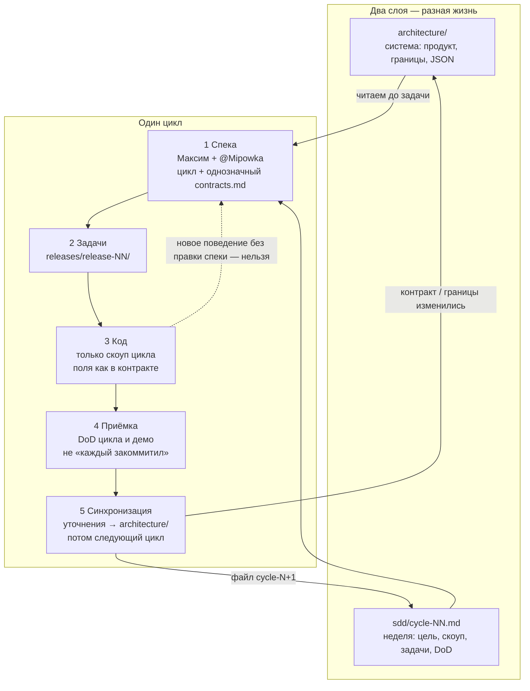
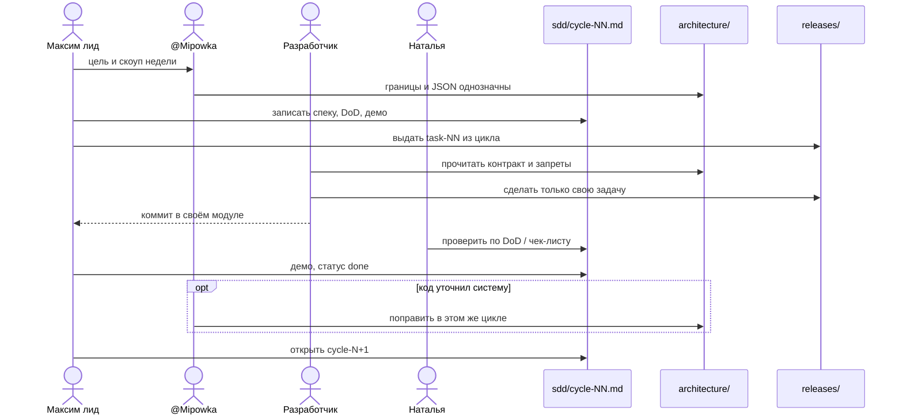

# SDD в contactApi

Команда работает по **Specification-Driven Development**: сначала фиксируем, *что* делаем в цикле, потом пишем код. Чат и память не являются источником правды.

## Схема метода

Два слоя документов и один проход цикла. Новый цикл не стартует, пока у текущего нет приёмки.

## Два слоя документов

| Слой | Где | Меняем когда |
|---|---|---|
| Система (долгоживущее) | `architecture/` | решение меняет продукт, границы сервисов или JSON |
| Цикл (короткое) | `sdd/cycle-NN.md` | каждый цикл: цель, скоуп, задачи, демо |

Архитектура отвечает на «как устроена система». Основа потока — схема «откуда что куда» в [architecture/system.md](../architecture/system.md). Цикл отвечает на «что команда сдаёт на этой неделе».

## Как идёт цикл

1. **Спека.** Лид (Максим) + архитектор (@Mipowka) пишут или обновляют `sdd/cycle-NN.md`. Контракт, который трогаем в цикле, должен быть однозначным в `architecture/contracts.md`.
2. **Задачи.** Из спеки цикла — файлы в `releases/release-NN/`. Одна задача — один модуль.
3. **Код.** Разработчик делает только то, что в своей задаче и в скоупе цикла. Новое поведение без правки спеки — нельзя.
4. **Приёмка.** Цикл закрыт, когда выполнен DoD цикла (не когда «каждый что-то закоммитил»).
5. **Синхронизация.** Если код уточнил контракт или границу — правим `architecture/` в том же цикле, до постановки следующего.

## Правила, которые не обсуждаем в задачах

- Клиенты ходят только в `rest-core`.
- `ai-core` — единственный, кто вызывает ProxyAI.
- `ai-core` не ходит в PostgreSQL.
- Секреты только через env.
- Илье задачи не ставим. Бухгалтерия Андрея — не в цикл.

## Текущий цикл

Активный: **[Цикл 03 / релиз 03](cycle-03.md)**. Задачи людям: [releases/release-03](../releases/release-03/README.md).

Циклы 01 и 02 закрыты. Feign и ProxyAI — релиз 04, не писать сейчас.
