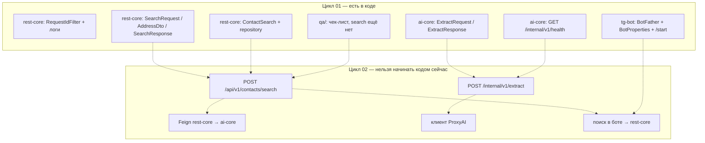

# Цикл 01 — Каркас и язык данных

| | |
|---|---|
| Статус | `done` (каркас в коде; хвосты — релиз 02) |
| Старт | 2026-09-05 |
| Приёмка | 2026-09-12 (демо с командой) |
| Владелец цикла | Максим |
| Архитектура цикла | Дмитрий @Mipowka |
| Продуктовая цель | Ещё нет поиска для пользователя. Цель цикла — чтобы три сервиса жили в одном языке данных и команда могла писать следующий срез не споря о полях. |

Это первый цикл. В коде — `task-02`…`task-08`. `task-01` снята: @Mipowka код не пишет. Новых задач в цикл не добавляем, пока не закроем эти семь и решения ниже.

---

## Зачем этот цикл

В репозитории пустые Spring Boot заготовки. Контракт есть только в markdown. Если сразу писать «название → телефон», люди разъедутся по полям, пакетам и логам.

Цикл 01 даёт общий каркас: пакеты, идентификатор запроса, health, сущности/DTO как в `contracts.md`, настройки бота, чек-лист QA.

Сплошные стрелки — делаем. Пунктир — цикл 02, в этом цикле не писать.

---

## Спека цикла (что считаем правдой)

Читать перед работой: [product.md](../architecture/product.md) → [system.md](../architecture/system.md) → [contracts.md](../architecture/contracts.md).

В этом цикле **замораживаем имена и форму данных v0**, не поведение поиска.

### Публичный JSON (rest-core) — форма, не эндпоинт

`SearchRequest`: `query` (обязательный), `city` (необязательный).

`SearchResponse`: `status`, `organizationName`, `normalizedQuery`, `address`, `phones`, `confidence`, `message`.

`AddressDto`: `full`, `country`, `city`, `street`, `building`, `postalCode`.

Эндпоинт `POST /api/v1/contacts/search` в цикле 01 **не открываем**.

### Внутренний JSON (ai-core) — форма, не эндпоинт

`ExtractRequest`: одно поле `text`.

`ExtractResponse`: плоский объект, без вложенного адреса: `status`, `organizationName`, `full`, `country`, `city`, `street`, `building`, `postalCode`, `phones`, `confidence`, `model`, `rawText`.

`POST /internal/v1/extract` в цикле 01 **не открываем**.

### Что уже можно вызвать

Только `GET /internal/v1/health` в `ai-core`. Ответ: `{ "status": "UP" }`.

### Решения, которые закрываем на приёмке цикла (Максим + @Mipowka)

Пока висят в черновике — цикл 02 нельзя честно ставить.

| Решение | Предложение в спеке | Нужно сказать «да» |
|---|---|---|
| Пустой поиск | `200` + `status=NOT_FOUND`, не HTTP 404 | да / нет |
| Телефоны наружу | массив строк E.164 (`phones: ["+7..."]`) | да / нет |
| Телефоны внутри ai-core | одна строка в `ExtractResponse.phones` | да / нет |
| Порты | 8080 rest-core, 8081 ai-core, 8082 tg-bot | да / нет |

Итог решений дописать сюда в день приёмки и перенести в `architecture/contracts.md` (снять статус «черновик» у замороженных пунктов).

---

## В скоупе

- Фильтр `X-Request-Id` / `requestId` в логах `rest-core`. Пустые пакеты не создаём.
- Health `ai-core`.
- Entity `ContactSearch` + репозиторий (таблица-заготовка, без записи поиска).
- DTO extract и public search один в один с контрактом.
- `BotProperties` из env, бот в BotFather, Telegram-библиотека, long polling, ответ на `/start`. Поиска в боте нет.
- Папка `qa/` с чек-листом и примером полей. Живые автотесты не требуются.
- [task-0001](task-0001/spec.md): изолированный `MessageValidator` в tg-bot (не вшивать в бота).

## Вне скоупа (цикл 02 и дальше)

- `POST /api/v1/contacts/search` и `POST /internal/v1/extract`.
- Feign между сервисами, ProxyAI, промпты.
- PostgreSQL как рабочее хранилище поиска (только заготовка entity).
- Поиск в боте (название → rest-core), токен в git.
- Docker/compose, CI, филиалы, ИНН, биллинг, корневой модуль `ContactApi` как сервис.

---

## Доска цикла

| Задача | Кто | Модуль | Суть | Статус |
|---|---|---|---|---|
| task-01 | Дмитрий @Mipowka | — | кодовая задача снята | снята |
| [task-02](../releases/release-01/task-02.md) | Дмитрий @Dimas5696 | ai-core | логи + `GET /internal/v1/health` | выдана |
| [task-03](../releases/release-01/task-03.md) | Дмитрий | rest-core | `ContactSearch` | выдана |
| [task-04](../releases/release-01/task-04.md) | Андрей | ai-core | `ExtractRequest` / `ExtractResponse` | выдана |
| [task-05](../releases/release-01/task-05.md) | Влад | rest-core | `SearchRequest` / `AddressDto` / `SearchResponse` | выдана |
| [task-06](../releases/release-01/task-06.md) | Олег | tg-bot | BotFather + Spring-бот + `/start` | выдана |
| [task-07](../releases/release-01/task-07.md) | Наталья | qa | чек-лист + пример полей | выдана |
| [task-08](../releases/release-01/task-08.md) | Дмитрий Заварин | rest-core | `ContactSearch` + repository | выдана |
| [task-0001](../releases/release-01/task-0001.md) | Максим (агент) | tg-bot | `MessageValidator` + два теста | done |
| решение контракта v0 | Максим + @Mipowka | — | четыре пункта в таблице выше | открыто |

Кроме `task-0001` (выдана лидом отдельно) новых номеров в этот цикл не заводим.

---

## DoD цикла

Цикл принят, если на демо 2026-09-12 верно всё сразу:

- [ ] `rest-core`, `ai-core`, `tg-bot` собираются и стартуют локально.
- [ ] В логе `rest-core` у HTTP-запроса виден `requestId`.
- [ ] `GET /internal/v1/health` → 200 и поле `status`.
- [ ] Поля DTO и entity совпадают со спекой выше (имена как в задачах, без «улучшений»).
- [ ] Токен бота и ключи ProxyAI не попали в git.
- [ ] В `qa/` есть чек-лист; в нём явно написано, что search API ещё нет.
- [ ] Четыре решения контракта записаны (да/нет) и перенесены в `contracts.md`.
- [ ] У каждого, кому выдана кодовая задача, есть коммит в своём модуле. @Mipowka код не коммитит.

Недостаточно: «классы набросаны, поля чуть другие» или «эндпоинт поиска уже начал писать — задел на потом».

---

## Демо (15 минут)

1. Дмитрий — лог rest-core: в строке есть `requestId`.
2. @Dimas5696 — curl health.
3. Влад и Андрей — показать поля классов рядом с `contracts.md`.
4. Дмитрий Заварин — класс `ContactSearch`, четыре поля.
5. Олег — бот в Telegram отвечает на `/start`, токена в репо нет.
6. Наталья — как будет проверять цикл 02.
7. @Mipowka — ревью границ и полей, не код.
8. Максим — озвучить заморозку контракта v0.

---

## После приёмки

1. В этом файле статус → `done`.
2. В `architecture/contracts.md` убрать «черновик» у замороченных решений.
3. Открыть **цикл 02**: публичный search + internal extract + Feign + первое сообщение бота (EPIC-1). Ставит Максим отдельным файлом `sdd/cycle-02.md`.
